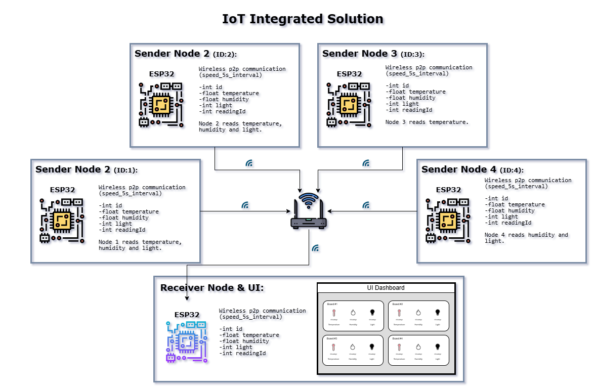
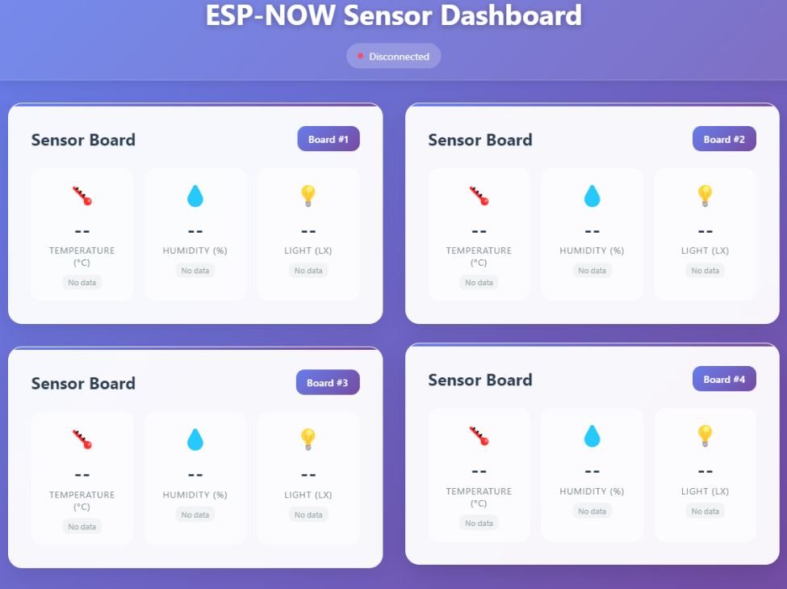

# Arduino-IoT-Sensor-Network
ESP-NOW Receiver Dashboard

This project is an ESP32-based receiver that uses **ESP-NOW** protocol to receive sensor data packets from multiple ESP32 sensor nodes. The receiver acts as a Wi-Fi station and runs an asynchronous web server to display a simple dashboard for monitoring sensor readings in real-time.


---

## Features

- Receives sensor data (temperature, humidity, light intensity, reading ID) from up to 4 ESP32 sensor nodes over ESP-NOW.
- Displays real-time sensor data on a web dashboard via HTTP server.
- Uses AsyncWebServer and Server-Sent Events (SSE) for live data communication.
- Wi-Fi station mode connects to your local network to provide access to the dashboard.
- Displays sender MAC address and validates incoming data.
---
## User Interface Dashboard



---

## Hardware

- ESP32 development board (receiver)
- Multiple ESP32 sensor nodes (senders) sending temperature, humidity, and light data via ESP-NOW
- Temperature & Humidity Sensor — Common choices: DHT11 or DHT22
- Light Sensor — Could be: A simple photoresistor (LDR)
- Breadboard

---

## Software Dependencies

- [ESPAsyncWebServer](https://github.com/me-no-dev/ESPAsyncWebServer)
- [Arduino_JSON](https://github.com/arduino-libraries/Arduino_JSON)
- ESP32 Arduino core (latest)

---

## Setup Instructions

1. **Configure Wi-Fi credentials**  
   Update the following lines in `receiver.ino` with your Wi-Fi network credentials:
   ```cpp
   const char* ssid = "YOUR_SSID";
   const char* password = "YOUR_PASSWORD";

   ## Flash the Code to Your ESP32 Receiver Board

2. **Use the Arduino IDE or PlatformIO to compile and upload the code to your ESP32 receiver board.**

3. **Connect Your ESP32 Sensor Nodes**

Make sure the sender nodes are programmed to transmit sensor data over ESP-NOW using the same data structure.

4. **Access the Dashboard**

After booting, the receiver will connect to your Wi-Fi and print the IP address in the Serial Monitor.  
Open the IP address in your browser to view the ESP-NOW Sensor Dashboard.

---
## How It Works
The receiver initializes Wi-Fi in station mode and connects to the specified network.

ESP-NOW is initialized, and a callback function OnDataRecv is registered to handle incoming data.

When sensor data is received, it is stored in an array corresponding to each board ID.

The receiver prints received data and the sender MAC address to the Serial Monitor.

An AsyncWebServer serves a simple HTML page for the dashboard.

Server-Sent Events (SSE) are used to push live updates to connected web clients every 5 seconds.
   
---
# Getting Started

## Installation (For Users)

### Set Up Hardware
- Connect the ESP32 boards as shown in the system diagram.
- Ensure all boards are powered and configured for wireless P2P communication.

### Upload Firmware
- Download the Arduino firmware .
- Flash the firmware onto each ESP32 board using an appropriate tool (e.g., ESP32 Flash Download Tool).

### Launch the System
- Power on all ESP32 boards.
- Access the UI dashboard on the receiver node to view real-time data.

---

### Installation (For Developers/Contributors)

1. **Fork the Repository**: Fork this repository to your GitHub account.
2. **Clone the Repository**:
   - Clone the repository:

     ```
     git clone <your-forked-repo-url>
     ```
3. **Set Up Development Environment**:
   - Open the project in your preferred IDE (e.g., Arduino IDE or PlatformIO).
   - Ensure the ESP32 board support package is installed.
4. **Upload and Test**:
   - Upload the code to each ESP32 board.
   - Test the system by monitoring the receiver node’s UI dashboard data.
